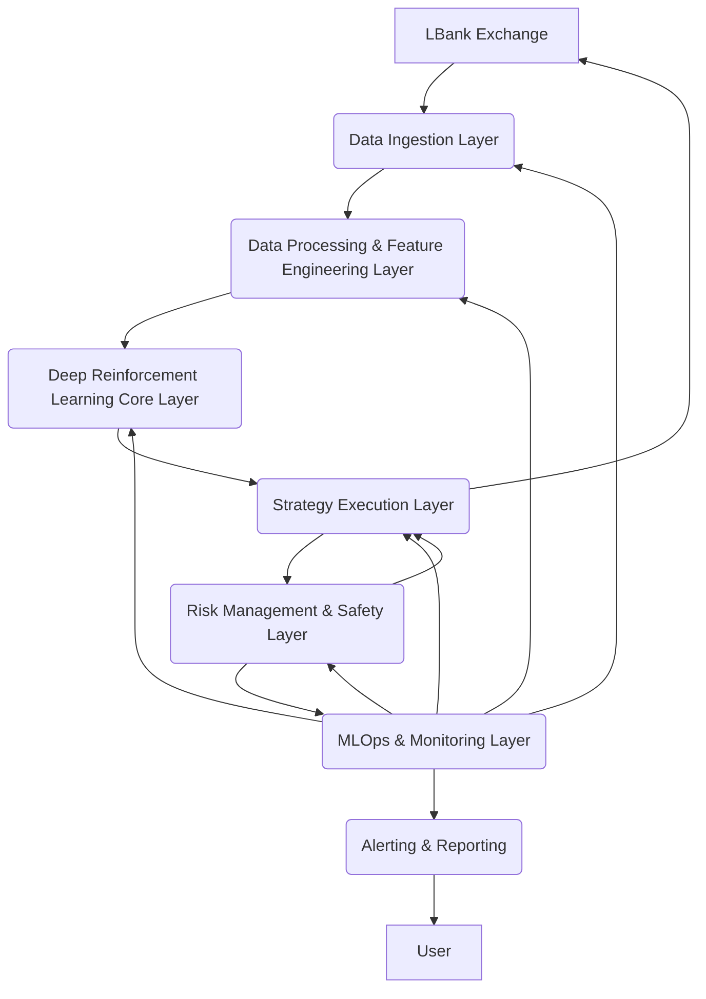

# NeuroTrade Comprehensive Documentation

## 1. Introduction
NeuroTrade is an advanced, intelligent crypto trading agent designed for autonomous operation on the LBank exchange. It integrates cutting-edge technologies in deep reinforcement learning (DRL), financial modeling, MLOps, and robust data engineering to deliver a sophisticated, adaptive, and secure trading solution. This document provides a comprehensive overview of the NeuroTrade system, detailing its architecture, module functionalities, setup procedures, operational guidelines, and best practices for deployment and maintenance.

## 2. System Architecture Overview
NeuroTrade is built upon a modular, layered architecture to ensure scalability, maintainability, and clear separation of concerns. The system comprises several interconnected layers, each responsible for a specific set of functionalities, from data ingestion to trade execution and risk management. The core design principles emphasize real-time processing, fault tolerance, and adaptability.

### 2.1. High-Level Architecture Diagram



### 2.2. Layered Breakdown

#### 2.2.1. Data Ingestion Layer
**Purpose**: Responsible for collecting real-time and historical market data from the LBank exchange.
**Key Components**:
- **`lbank_connector.py`**: This module is the primary interface for interacting with LBank's API. It utilizes the `ccxt` library to handle:
    - **Historical Data**: Fetches historical OHLCV (Open, High, Low, Close, Volume) data for backtesting and initial model training.
    - **Real-time Data Streams**: Establishes WebSocket connections to stream live kline (candlestick), trade, and order book depth data. This data is then published to Kafka topics for further processing.
- **Kafka Producer**: Integrates with Kafka to ensure efficient and scalable streaming of raw market data.

#### 2.2.2. Data Processing & Feature Engineering Layer
**Purpose**: Transforms raw market data into actionable features for the DRL models and other system components.
**Key Components**:
- **`feature_engineer.py`**: Consumes raw data from Kafka, calculates a wide array of technical indicators (e.g., Moving Averages, RSI, MACD, Bollinger Bands) and other market features (e.g., volatility, liquidity, order book imbalance) using libraries like `pandas-ta`.
- **`data_storage.py`**: Manages the storage of processed data and features. It primarily uses:
    - **InfluxDB**: For storing time-series data (OHLCV, technical indicators) for quick retrieval and analysis.
    - **Feature Store**: A local or distributed storage solution for managing and versioning features used in ML model training and inference.
- **Kafka Consumer/Producer**: Consumes raw data and publishes processed features back to Kafka, enabling a stream-processing pipeline.

#### 2.2.3. Deep Reinforcement Learning (DRL) Core Layer
**Purpose**: Houses the intelligence of the trading agent, responsible for learning and generating trading signals.
**Key Components**:
- **`trading_environment.py`**: Defines a custom Gymnasium (formerly OpenAI Gym) environment that simulates the LBank trading environment. This environment interacts with historical and real-time market data, executes simulated trades, and provides rewards/penalties to the DRL agent based on its actions and portfolio performance. It's crucial for training and evaluating DRL models.
- **`rl_agents.py`**: Implements various DRL algorithms (e.g., PPO, A2C, SAC) using PyTorch and Stable Baselines3. These agents learn optimal trading policies by interacting with the `trading_environment.py`.
- **`training_pipeline.py`**: Orchestrates the entire DRL model training process, including data loading, environment initialization, agent training, evaluation, and model saving. It integrates with MLflow for experiment tracking and model versioning.

#### 2.2.4. Strategy Execution Layer
**Purpose**: Translates DRL-generated signals into actual trade orders and manages the trading portfolio.
**Key Components**:
- **`signal_processor.py`**: Receives trading signals from the DRL core (or other strategy modules) and converts them into a standardized format for order execution. It may perform initial checks or transformations on the signals.
- **`order_manager.py`**: Responsible for interacting with LBank's trading API to place, cancel, and query orders. It handles order types (market, limit), order status updates, and ensures reliable communication with the exchange.
- **`portfolio_manager.py`**: Tracks the current state of the trading portfolio, including asset balances, open positions, PnL (Profit and Loss), and overall portfolio value. It provides real-time portfolio snapshots to the risk management layer.

#### 2.2.5. Risk Management & Safety Layer
**Purpose**: Ensures the trading system operates within predefined risk tolerances and implements safety protocols to prevent catastrophic losses.
**Key Components**:
- **`risk_assessor.py`**: Calculates various risk metrics (e.g., VaR, CVaR, Sharpe Ratio, Drawdown, Volatility, Correlation Risk, Liquidity Score) based on the current portfolio and market conditions. It assesses the overall risk level of the portfolio.
- **`safety_protocols.py`**: Implements a multi-tiered system of circuit breakers and automated responses. This includes:
    - **Dynamic Position Sizing**: Adjusts trade quantities based on current risk levels.
    - **Drawdown Limits**: Triggers actions (e.g., position reduction, trading halt) if portfolio drawdown exceeds thresholds.
    - **Volatility Controls**: Restricts trading during periods of extreme market volatility.
    - **Consecutive Loss Tracking**: Monitors losing streaks and can initiate temporary trading halts.
    - **Manual Override**: Provides mechanisms for human intervention.
- **`risk_integration.py`**: Acts as the central hub for risk management. It intercepts trading signals, passes them through the `risk_assessor` and `safety_protocols`, and either approves, modifies, or rejects trades based on the risk assessment. It also performs post-trade analysis to update risk metrics.

#### 2.2.6. MLOps & Monitoring Layer
**Purpose**: Provides capabilities for deploying, monitoring, and managing the lifecycle of DRL models and the overall system.
**Key Components**:
- **`model_deployment.py`**: Handles the deployment of trained DRL models. It supports model versioning (MLflow integration), containerization (Docker), and orchestration (Kubernetes) for scalable and reliable model serving.
- **`monitoring_system.py`**: Collects real-time metrics on system health (CPU, memory, network), trading performance (PnL, win rate, trade count), and model performance (inference latency, signal quality). It integrates with alerting mechanisms (email, Slack) to notify operators of anomalies or critical events.
- **`logging_auditing.py`**: Implements a comprehensive logging and auditing system to record all significant system events, trading decisions, and risk actions. This is crucial for debugging, post-mortem analysis, and regulatory compliance.

## 3. Setup and Installation Guide
This section details the steps required to set up and run the NeuroTrade system.

### 3.1. Prerequisites
- Python 3.8 or higher
- Docker and Docker Compose (optional, but recommended for Kafka and InfluxDB)
- Git

### 3.2. Step-by-Step Installation

#### 3.2.1. Clone the Repository
Begin by cloning the NeuroTrade GitHub repository to your local machine:

```bash
git clone https://github.com/Manooocher/NeuroTrade.git
cd NeuroTrade
```

#### 3.2.2. Set up Environment Variables
Create a `.env` file in the root directory of the project. This file will store your sensitive API credentials and other configuration parameters. Obtain your LBank API Key and Secret Key from your LBank account's API Management section. Ensure these keys have the necessary permissions for trading and data access.

Example `.env` file content:

```ini
# General Settings
ENV=development
LOG_LEVEL=INFO
DEBUG_MODE=True

# Exchange API Credentials (LBank)
LBANK_API_KEY="YOUR_LBANK_API_KEY"
LBANK_SECRET_KEY="YOUR_LBANK_SECRET_KEY"
LBANK_TESTNET=True  # Set to False for live trading on LBank

# Kafka Settings
KAFKA_BOOTSTRAP_SERVERS="localhost:9092"
MOCK_KAFKA=False # Set to True for testing without a running Kafka instance

# InfluxDB Settings
INFLUXDB_URL="http://localhost:8086"
INFLUXDB_TOKEN="YOUR_INFLUXDB_TOKEN"
INFLUXDB_ORG="neurotrade"
INFLUXDB_BUCKET="market_data"

# Feature Store Settings
FEATURE_STORE_PATH="./feature_store"

# Model Management Settings
MODELS_DIR="./models"
MODEL_RETENTION_VERSIONS=10
MLFLOW_TRACKING_URI="./mlruns"

# Trading Engine Settings
TRADING_FEE_RATE=0.001 # LBank trading fee rate (e.g., 0.1% for spot trading)
SLIPPAGE_RATE=0.0001
INITIAL_BALANCE=10000.0 # Initial balance for backtesting or paper trading simulations

# Risk Management Settings
MAX_DRAWDOWN_PERCENT=0.20
MAX_POSITION_SIZE_PERCENT=0.10
VOLATILITY_THRESHOLD=0.05
CORRELATION_THRESHOLD=0.80

# Monitoring Settings
MONITORING_INTERVAL_SECONDS=60
ALERT_EMAIL_SENDER="your_email@example.com"
ALERT_EMAIL_RECIPIENTS="recipient_email@example.com"
ALERT_EMAIL_PASSWORD="your_email_password"
ALERT_SLACK_WEBHOOK="your_slack_webhook_url"

# Audit Settings
AUDIT_LOG_RETENTION_DAYS=30

# Backtesting Settings
BACKTESTING_RESULTS_DIR="./backtesting_results"
```

#### 3.2.3. Install Python Dependencies
It is highly recommended to use a Python virtual environment to manage dependencies.

```bash
python3 -m venv venv
source venv/bin/activate  # On Windows, use `venv\Scripts\activate`
pip install -r requirements.txt
```

**Troubleshooting `ta-lib` Installation**:
If you encounter issues installing `ta-lib`, you might need to install its system-level dependencies first. For Ubuntu/Debian-based systems, use the following commands:

```bash
sudo apt-get update
sudo apt-get install -y build-essential
wget http://prdownloads.sourceforge.net/ta-lib/ta-lib-0.4.0-src.tar.gz
tar -xzf ta-lib-0.4.0-src.tar.gz
cd ta-lib
./configure --prefix=/usr/local
sudo make
sudo make install
cd ..
pip install ta-lib
```

#### 3.2.4. Set up Kafka and InfluxDB with Docker Compose (Optional, but Recommended)
NeuroTrade is designed to leverage Kafka for real-time data streaming and InfluxDB for efficient time-series data storage. You can easily set up these services using Docker Compose.

Create a `docker-compose.yml` file in the root directory of your project:

```yaml
version: '3.8'

services:
  zookeeper:
    image: confluentinc/cp-zookeeper:7.0.1
    hostname: zookeeper
    container_name: zookeeper
    ports:
      - 


      - "2181:2181"
    environment:
      ZOOKEEPER_CLIENT_PORT: 2181
      ZOOKEEPER_TICK_TIME: 2000

  kafka:
    image: confluentinc/cp-kafka:7.0.1
    hostname: kafka
    container_name: kafka
    ports:
      - "9092:9092"
      - "9094:9094"
    environment:
      KAFKA_BROKER_ID: 1
      KAFKA_ZOOKEEPER_CONNECT: 'zookeeper:2181'
      KAFKA_LISTENER_SECURITY_PROTOCOL_MAP: PLAINTEXT:PLAINTEXT,PLAINTEXT_HOST:PLAINTEXT
      KAFKA_ADVERTISED_LISTENERS: PLAINTEXT://kafka:9092,PLAINTEXT_HOST://localhost:9094
      KAFKA_OFFSETS_TOPIC_REPLICATION_FACTOR: 1
      KAFKA_GROUP_INITIAL_REBALANCE_DELAY_MS: 0
      KAFKA_AUTO_CREATE_TOPICS_ENABLE: "true"
    depends_on:
      - zookeeper

  influxdb:
    image: influxdb:2.7
    container_name: influxdb
    ports:
      - "8086:8086"
    environment:
      DOCKER_INFLUXDB_INIT_MODE: setup
      DOCKER_INFLUXDB_INIT_USERNAME: neurotrade_user
      DOCKER_INFLUXDB_INIT_PASSWORD: neurotrade_password
      DOCKER_INFLUXDB_INIT_ORG: neurotrade
      DOCKER_INFLUXDB_INIT_BUCKET: market_data
      DOCKER_INFLUXDB_INIT_ADMIN_TOKEN: YOUR_INFLUXDB_TOKEN # Replace with a strong token
    volumes:
      - influxdb_data:/var/lib/influxdb2

volumes:
  influxdb_data:
```

To start these services, navigate to the root directory of your NeuroTrade project and run:

```bash
docker-compose up -d
```

**Important**: Remember to replace `YOUR_INFLUXDB_TOKEN` in the `docker-compose.yml` file with the exact token you specified in your `.env` file.

## 4. Running the System
Once the dependencies are installed and Kafka/InfluxDB are set up (if you chose to use them), you can start the various components of the NeuroTrade system.

### 4.1. Start Data Ingestion
This component connects to LBank, streams real-time market data, and publishes it to Kafka topics. It also handles historical data fetching.

```bash
python -m data_ingestion.lbank_connector
```

### 4.2. Start Feature Engineering (Data Processing)
This module consumes raw market data from Kafka, calculates various technical indicators and other features, and then publishes the processed data back to Kafka. This processed data is crucial for the DRL agent.

```bash
python -m data_processing.feature_engineer
```

### 4.3. Train DRL Agent (Initial Training)
This step initiates the training process for your Deep Reinforcement Learning agent. It will use the `trading_environment.py` to simulate interactions with the market and learn optimal trading strategies. Ensure you have sufficient historical data available for effective training.

```bash
python -m drl_core.training_pipeline
```

### 4.4. Start Trading Engine
This is the core operational component. It consumes trading signals generated by the DRL agent (or other strategies), performs real-time risk assessment, and executes trades on the LBank exchange based on the approved signals.

```bash
python -m main  # Assuming 'main.py' is your primary entry point for the trading system
```

### 4.5. Start Monitoring System
To ensure the continuous health and optimal performance of your NeuroTrade system, it is essential to run the monitoring component. This module collects system metrics, trading performance data, and model health indicators, sending alerts if predefined thresholds are breached.

```bash
python -m mlops_monitoring.monitoring_system
```

## 5. Project Structure
For a detailed understanding of the project layout and file organization, refer to the `README.md` file in the root of the repository. It provides a clear directory tree and a brief description of each module.

## 6. LBank API Documentation
For developers and advanced users who wish to delve deeper into the LBank API or extend its functionalities, the official LBank API documentation is an invaluable resource:

- [LBank Official API Documentation](https://www.lbank.com/docs/index.html)
- [LBank GitHub API Documentation](https://github.com/LBank-exchange/lbank-official-api-docs)

## 7. Conclusion
NeuroTrade represents a robust and intelligent solution for automated crypto trading on the LBank exchange. Its modular design, coupled with advanced DRL capabilities and comprehensive risk management, provides a powerful platform for developing and deploying adaptive trading strategies. By following this documentation, users can effectively set up, operate, and maintain the NeuroTrade system, leveraging its full potential in the dynamic cryptocurrency market.

---

**Author**: Manus AI
**Project**: NeuroTrade
**Date**: July 26, 2025


